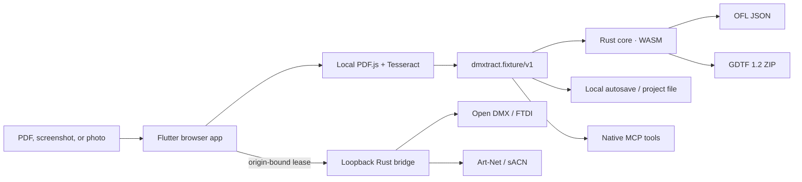

# Architecture

DMXtract is local-first by design. The Flutter web app reads the manual with checked-in PDF.js and Tesseract workers. It converts detected data into `dmxtract.fixture/v1`, keeps edits in browser storage, and lets the user download an editable project.

The canonical Rust crate owns validation, OFL serialization, and GDTF 1.2 ZIP creation. The same crate runs in the browser as WebAssembly and natively inside the bridge/MCP process. This avoids format behavior diverging between the website and native integrations.

The bridge binds only to `127.0.0.1`. It provides Art-Net, sACN, preview, and Open DMX/FTDI outputs. Pairing tokens are bound to the requesting web origin, one output controller may hold a lease at a time, and the 1.5-second watchdog sends a zero frame when heartbeats stop.

The public web app has no analytics, account requirement, inference API, or
manual upload path. Its only optional server function is the privacy-minimized
fixture lookup proxy described in
[`fixture-lookup-v1.openapi.yaml`](../schemas/fixture-lookup-v1.openapi.yaml).
That function is disabled unless a deployer supplies a trusted provider URL;
provider tokens never enter the browser or MCP process.
